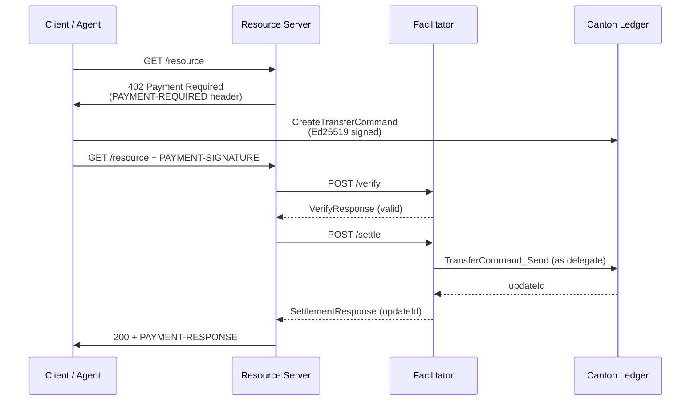

The [x402 protocol](https://x402.org) is an HTTP payment standard built around the `402 Payment Required` status code. A server responds with payment requirements; the client pays on-chain and retries. No API keys, no billing accounts — payment is the credential.

On Canton Network, x402 uses the `exact-canton` scheme: the client creates a `TransferCommand` on the Canton ledger using Ed25519 external-party signing, and a facilitator exercises `TransferCommand_Send` — moving Canton Coin atomically while sponsoring sequencer traffic fees.

## How It Works



The facilitator acts as `delegate` on the `TransferCommand`. Canton's privacy model makes the contract visible to the facilitator solely because of this stakeholder role — without `delegate = facilitatorParty`, the facilitator cannot read the command and verification fails.

## Scheme: `exact-canton`

| Field | Value |
|---|---|
| `scheme` | `exact-canton` |
| `asset` | `canton-coin` |
| `transferMethod` | `external-party-amulet-rules` |
| Networks | `canton:mainnet`, `canton:testnet` |

### PaymentRequirements structure

```json
{
  "scheme": "exact-canton",
  "network": "canton:mainnet",
  "amount": "0.0300000000",
  "asset": "canton-coin",
  "payTo": "merchant_party::1220abc...",
  "maxTimeoutSeconds": 60,
  "extra": {
    "transferMethod": "external-party-amulet-rules",
    "facilitatorParty": "facilitator::1220def...",
    "synchronizerId": "global-domain::1220xyz..."
  }
}
```

`amount` is a Daml Decimal string — always 10 decimal places. `"0.0300000000"` = 0.03 CC, `"1.0000000000"` = 1 CC. The facilitator does a strict string comparison; numeric coercion is not applied.

## Running a Facilitator

The reference facilitator is available as a Docker image. It connects to a Canton participant and uses SV Scan for contract resolution.

```bash
docker run -d \
  -e CANTON_RELAY_URL=https://your-participant:5003 \
  -e CANTON_PARTY=facilitator::1220... \
  -e CANTON_NETWORK=canton:mainnet \
  -e CANTON_SCAN_URL=https://scan.sv-1.global.canton.network.digitalasset.com:8443 \
  -p 3000:3000 \
  ghcr.io/ftptech/canton-x402-facilitator:latest
```

The facilitator exposes two routes:

- `POST /verify` — validates a `TransferCommand` against `PaymentRequirements`
- `POST /settle` — exercises `TransferCommand_Send` and returns the ledger `updateId`

To discover the facilitator's party ID and synchronizer ID:

```bash
curl https://facilitator.ftptech.xyz/supported
```

```json
{
  "kinds": [{ "scheme": "exact-canton", "network": "canton:mainnet" }],
  "signers": {
    "canton:*": ["FTP-validator-1::1220c065..."]
  }
}
```

## Replay Protection

Canton provides native replay protection. `TransferCommand_Send` archives the contract; a second `Send` on the same contract ID fails at the ledger. If `/settle` is called twice for the same `transferCommandCid`, the facilitator returns `invalid_exact_canton_transfer_command_not_found` — the same code as "contract not found." Treat this as confirmation that the original settlement succeeded.

## Error Codes

| Code | Meaning |
|---|---|
| `invalid_exact_canton_transfer_command_not_found` | Contract not in facilitator's ACS: not created, already settled, or `delegate` set to wrong party |
| `invalid_exact_canton_amount_mismatch` | `TransferCommand.amount` ≠ `PaymentRequirements.amount` (string mismatch) |
| `invalid_exact_canton_expired` | `expiresAt` is past or within the 5-second safety margin |
| `invalid_exact_canton_nonce_reuse` | Nonce is below the sender's `nextNonce` counter on Scan |
| `invalid_exact_canton_resource_url_mismatch` | `description.resourceUrl` ≠ `resource.url` |
| `invalid_exact_canton_merchant_not_registered` | `MerchantContract` absent or belongs to a different merchant |
| `unexpected_canton_ledger_error` | Scan or ledger timeout not covered by the above codes |

## Live Examples

- **[TransparentscanXYZ](https://transparentscan.xyz)** — public Canton ledger explorer with x402-gated endpoints at `/api/v1/x402/ledger-end` and `/api/v1/x402/round`, 0.03 CC per call on `canton:mainnet`
- **[CanTrustAI](https://cantrustai.xyz)** — LLM inference gated with x402, multiple open-source models, on `canton:mainnet`

## Related Pages

- [x402 Merchant Integration](/sdks-tools/development-tools/x402-merchant) -- Add x402 to your Express or Next.js API
- [x402 Agent Integration](/sdks-tools/development-tools/x402-agent) -- Make x402 payments from an automated agent
- [Wallet Gateway](/integrations/wallet-gateway/download) -- Canton wallet integration for end users
